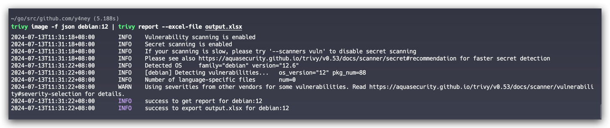
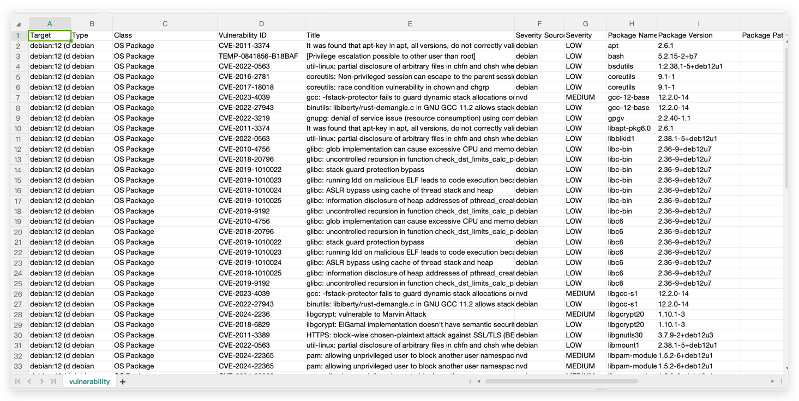
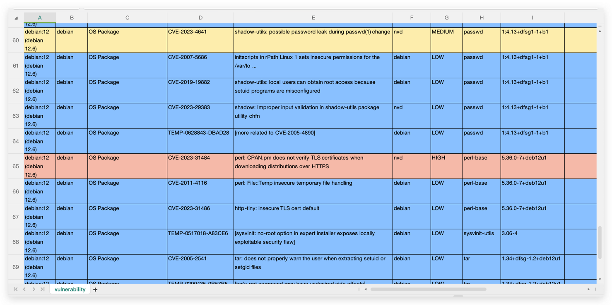

# 🔍  trivy-plugin-report

[简体中文](./README_zh.md)

📊 `trivy-plugin-report` is a plugin that can convert Trivy's output in JSON format into an EXCEL and
nd Markdown files.

## 🤔 Why is it needed?

Trivy can output reports in various formats, but these reports are more suitable for technical personnel 
to study and fix vulnerabilities.

In many business scenarios, we also need to present security risks in a more understandable way 
to non-technical personnel, making EXCEL files particularly important.

In addition, we need to compile a comprehensive scan report that will outline the artifact information, 
image configuration, vulnerability overview, as well as detailed vulnerability information. The Markdown format is particularly suitable for editing and reviewing such reports, making it an ideal medium for this purpose.


## 🌟 Features

- **Trivy Compatibility**: Supports reports generated by Trivy.
- **Office Friendly**: Converts to EXCEL format, suitable for non-technical personnel to read and report.
- **Convenient Editing and Sharing**: Documents in Markdown format serve as a carrier for scan reports, facilitating rapid editing and sharing of key security information.

## 🛠️ Installation

```shell
trivy plugin install github.com/y4ney/trivy-plugin-report
```

## 🚀 Usage

```shell
trivy image --format json -d --output plugin=report [--output-plugin-arg plugin_flags] <image_name>
```

OR

```shell
trivy image -f json <image_name> | trivy report [plugin_flags]
```

## 📝  Common Usage

1. Generate an EXCEL table and name it `output.xlsx`
    ```bash
    trivy image -f json debian:12 | trivy report --excel-file output.xlsx
    ```
   
   

2. Use `--beautify` to beautify the EXCEL file, that is, fill in the background color according to 
the severity of the vulnerabilities.
   ```bash
   trivy image -f json debian:12 | trivy report --excel-file output-beautify.xlsx --beautify
   ```
   
3. Generate an Markdown table and name it `output.md`
 ```bash
trivy image -f json sonobuoy/kube-hunter:v0.2.0 | trivy report --markdown-file output.md
 ```
For details, see [kube-hunter.md](./internal/markdown/testdata/kube-hunter.md)


## TODO
- [x] 📝 Export markdown file
- [ ] 📝 Export PDF file
- [ ] 🌏 Localize the report to Chinese
- [ ] 🌁 Add Alibaba vulnerability source
- [ ] 🚀 Add CNNVD vulnerability source
- [ ] 🛡️ Support for misconfiguration, license, and secret